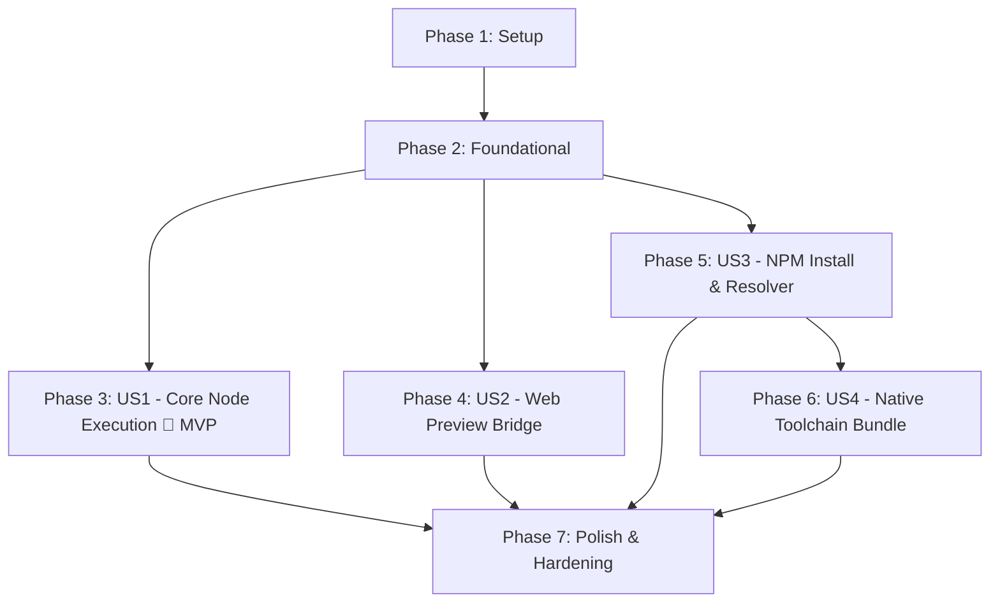

# Tasks: Client-Side Node.js Sandbox NPM SDK

**Branch / Feature**: `001-client-side-node`  
**Package Scope**: `@buddhilive/sandbox`  
**Input Specs**: [`spec.md`](./spec.md) · [`plan.md`](./plan.md)  
**Status**: Ready for Implementation  

---

## Phase 1: Setup (Shared Infrastructure)

**Purpose**: Project initialization, monorepo configuration, tooling, and build pipeline setup.

- [x] T001 Initialize pnpm workspace and root configuration in `package.json`, `pnpm-workspace.yaml`, and `.npmrc`
- [x] T002 [P] Configure root TypeScript and build tooling in `tsconfig.base.json`
- [x] T003 [P] Initialize Rust WASM crate structure in `packages/wasm-core/Cargo.toml`, `packages/wasm-core/build.rs`, and `packages/wasm-core/src/lib.rs`
- [x] T004 [P] Initialize TypeScript SDK package in `packages/sdk/package.json`, `packages/sdk/tsconfig.json`, and `packages/sdk/vite.config.ts`
- [x] T005 [P] Initialize Service Worker package in `packages/service-worker/package.json`, `packages/service-worker/tsconfig.json`, and `packages/service-worker/vite.config.ts`
- [x] T006 [P] Initialize Toolchain Bundle package in `packages/toolchain-bundle/package.json` and `packages/toolchain-bundle/tsconfig.json`
- [x] T007 [P] Initialize browser demo and E2E test harness in `apps/sandbox-demo/package.json`, `apps/sandbox-demo/index.html`, and `apps/sandbox-demo/vite.config.ts`
- [x] T008 [P] Configure Vitest and Playwright test environments in `packages/sdk/vitest.config.ts` and `playwright.config.ts`

---

## Phase 2: Foundational (Blocking Prerequisites)

**Purpose**: Core data structures, memory layout, shared protocols, and communication bridge that MUST be complete before ANY user story can proceed.

**⚠️ CRITICAL**: No user story implementation can begin until this foundational phase is complete.

- [x] T009 Define core TypeScript types and options in `packages/sdk/src/types.ts` (`SandboxOptions`, `ProcessHandle`, `FileStat`, `ListenEvent`, `SandboxError`)
- [x] T010 Implement custom WASM error types and memory tracking structures in `packages/wasm-core/src/error.rs`
- [x] T011 Implement in-memory Inode table and POSIX node representations in `packages/wasm-core/src/vfs/inode.rs` and `packages/wasm-core/src/vfs/file.rs`
- [x] T012 Implement SharedArrayBuffer (SAB) ring-buffer and atomic signaling protocol in `packages/wasm-core/src/process/io.rs`
- [x] T013 Implement host-side SharedArrayBuffer reader and atomic writer in `packages/sdk/src/worker-bridge.ts`
- [x] T014 Implement dedicated Web Worker entrypoint and WASM initialization loader in `packages/sdk/src/worker/sandbox.worker.ts`
- [x] T015 Implement `Sandbox` base lifecycle orchestrator (`create()`, `dispose()`, health check) in `packages/sdk/src/sandbox.ts` and `packages/sdk/src/index.ts`
- [x] T016 Write foundational unit tests for worker instantiation and SAB handshake in `packages/sdk/tests/unit/sandbox-init.test.ts`

**Checkpoint**: Core Rust WASM module builds with `wasm-pack`, loads inside the Web Worker, and establishes two-way atomic communication with the main thread SDK.

---

## Phase 3: User Story 1 - Client-Side NPM SDK & Core Node.js Execution (Priority: P1) 🎯 MVP

**Goal**: Deliver the minimal viable product: installable `@buddhilive/sandbox` SDK that instantiates an in-browser sandbox, provides virtual filesystem operations, executes Node.js code via QuickJS inside WebAssembly, and streams `stdout`, `stderr`, and exit codes.

**Independent Test**: Install package in a Vite app, call `Sandbox.create()`, write `/hello.js` via `sandbox.fs.writeFile()`, execute `sandbox.process.spawn('node', ['/hello.js'])`, and verify that `stdout` emits `"Hello from sandbox\n"` and exit code resolves to `0`.

### Tests for User Story 1 ⚠️

> **NOTE: Write these tests FIRST, ensure they FAIL before implementation**

- [x] T017 [P] [US1] Unit tests for VirtualFS POSIX operations (`writeFile`, `readFile`, `mkdir`, `readdir`, `stat`, `rm`) in `packages/sdk/tests/unit/fs.test.ts`
- [x] T018 [P] [US1] Unit tests for process spawning, streaming `stdout`/`stderr`, and `stdin` input in `packages/sdk/tests/unit/process-spawn.test.ts`
- [x] T019 [P] [US1] Browser E2E test for complete Node.js script execution lifecycle in `packages/sdk/tests/e2e/us1-node-execution.spec.ts`

### Implementation for User Story 1

- [x] T020 [P] [US1] Implement VirtualFS POSIX operations (`read_file`, `write_file`, `mkdir`, `readdir`, `rm`, `stat`) in `packages/wasm-core/src/vfs/mod.rs`
- [x] T021 [US1] Expose VirtualFS operations to JavaScript via `#[wasm_bindgen]` in `packages/wasm-core/src/lib.rs`
- [x] T022 [US1] Implement QuickJS runtime wrapper and JS context initialization in `packages/wasm-core/src/process/context.rs`
- [x] T023 [US1] Implement Node.js global stubs (`console.log`, `process.stdout.write`, `process.stderr.write`, `process.exit`, `process.env`, `Buffer`) in `packages/wasm-core/src/process/context.rs`
- [x] T024 [US1] Implement ProcessManager table, PID allocation, and lifecycle management in `packages/wasm-core/src/process/mod.rs`
- [x] T025 [P] [US1] Implement `sandbox.fs` proxy namespace over Worker postMessage in `packages/sdk/src/fs-namespace.ts`
- [x] T026 [US1] Implement `sandbox.process` namespace and `ProcessHandle` stream wrappers (`ReadableStream`/`WritableStream`) in `packages/sdk/src/process-namespace.ts`
- [x] T027 [US1] Wire message dispatching for `fs` and `process` calls in `packages/sdk/src/worker/sandbox.worker.ts`
- [x] T028 [US1] Create interactive demo page for running custom Node.js code and viewing streaming output in `apps/sandbox-demo/src/main.ts`

**Checkpoint**: User Story 1 is fully functional and testable independently. Host apps can write files, execute scripts, and stream output without any backend.

---

## Phase 4: User Story 2 - In-Browser Web Application Preview via Virtual URL (Priority: P2)

**Goal**: Expose virtual TCP/HTTP server listeners created inside the sandbox (e.g., `http.createServer().listen(3000)`) as in-browser preview URLs (`/__preview/:port/`) rendered through a Service Worker without network requests.

**Independent Test**: Run a Node.js script that creates an HTTP server on port 3000, listen for `sandbox.ports.on('listen')`, verify the preview URL, and issue a `fetch('/__preview/3000/')` call or iframe load asserting that HTTP status 200 and response body are received.

### Tests for User Story 2 ⚠️

> **NOTE: Write these tests FIRST, ensure they FAIL before implementation**

- [x] T029 [P] [US2] Unit tests for port registration, listener event emitter, and 503 fallback in `packages/sdk/tests/unit/ports.test.ts`
- [x] T030 [P] [US2] Browser E2E test for HTTP server listen, Service Worker interception, and iframe preview in `packages/sdk/tests/e2e/us2-preview.spec.ts`

### Implementation for User Story 2

- [x] T031 [P] [US2] Implement virtual port table and TCP socket state management in `packages/wasm-core/src/ports/mod.rs`
- [x] T032 [US2] Implement HTTP request/response demultiplexing over MessageChannel in `packages/wasm-core/src/ports/http.rs`
- [x] T033 [US2] Implement Node.js `http` module stubs (`createServer`, `ServerResponse`, `IncomingMessage`, `listen`, `close`) in `packages/wasm-core/src/process/context.rs`
- [x] T034 [P] [US2] Implement active port registry mapping port to Worker MessagePort in `packages/service-worker/src/port-registry.ts`
- [x] T035 [US2] Implement HTTP fetch bridge translating Service Worker `Request` to MessageChannel payload in `packages/service-worker/src/request-bridge.ts`
- [x] T036 [US2] Implement Service Worker fetch interception for `/__preview/:port/*` and 502/503 handling in `packages/service-worker/src/sw.ts`
- [x] T037 [US2] Implement Service Worker restart and reconnection handshake via BroadcastChannel in `packages/service-worker/src/reconnect.ts`
- [x] T038 [US2] Implement `sandbox.ports` namespace and EventEmitter in `packages/sdk/src/ports-namespace.ts`
- [x] T039 [US2] Add live web server preview frame to demo app in `apps/sandbox-demo/src/preview-demo.ts`

**Checkpoint**: User Stories 1 and 2 work independently and together. Virtual HTTP servers render inside client-side `<iframe>` tags.

---

## Phase 5: User Story 3 - Pure-JS NPM Package Installation & Module Resolution (Priority: P3)

**Goal**: Enable client-side `npm install <pkg>` by fetching manifests and tarballs from `registry.npmjs.org`, decompressing with `fflate`, writing to virtual `/node_modules`, and resolving them via standard Node.js `require()` and ESM `import`.

**Independent Test**: Execute `await sandbox.process.exec('npm install lodash')`, verify `/node_modules/lodash/package.json` exists in VirtualFS, execute a script with `const _ = require('lodash'); console.log(_.VERSION)`, and assert that the lodash version is printed with exit code 0.

### Tests for User Story 3 ⚠️

> **NOTE: Write these tests FIRST, ensure they FAIL before implementation**

- [x] T040 [P] [US3] Unit tests for NPM registry fetching, tarball decompression, and CORS mirror fallback in `packages/sdk/tests/unit/npm-installer.test.ts`
- [x] T041 [P] [US3] Unit tests for Node.js module resolution algorithm and package.json exports in `packages/sdk/tests/unit/module-resolver.test.ts`
- [x] T042 [P] [US3] Browser E2E test for `npm install lodash` and runtime execution in `packages/sdk/tests/e2e/us3-npm-install.spec.ts`

### Implementation for User Story 3

- [x] T043 [P] [US3] Implement POSIX symlink support (`symlink`, `readlink`, hop-limit resolution) in `packages/wasm-core/src/vfs/symlink.rs`
- [x] T044 [US3] Implement Node.js module resolution logic in Rust (`/node_modules` traversal, `index.js`, `.json`) in `packages/wasm-core/src/process/resolver.rs`
- [x] T045 [P] [US3] Implement client-side module resolution helper in TypeScript in `packages/sdk/src/module-resolver.ts`
- [x] T046 [US3] Implement NPM registry client, tarball stream download, and `fflate` untar in `packages/sdk/src/npm-installer.ts`
- [x] T047 [US3] Implement `package.json` dependency updater and virtual `/node_modules/.bin` symlink creator in `packages/sdk/src/npm-installer.ts`
- [x] T048 [US3] Implement `sandbox.process.exec(cmd)` execution helper in `packages/sdk/src/process-namespace.ts`
- [x] T049 [US3] Wire `require()` and ES dynamic `import()` loader hooks to VirtualFS in `packages/wasm-core/src/process/context.rs`
- [x] T050 [US3] Add package installer UI and terminal execution to demo app in `apps/sandbox-demo/src/main.ts`

**Checkpoint**: User Stories 1, 2, and 3 are functional. Developers can install pure-JS packages from NPM and require them in virtual scripts.

---

## Phase 6: User Story 4 - On-Demand Dynamic Toolchain for Native C/Python Builds (Priority: P4)

**Goal**: Detect packages requiring native compilation (`binding.gyp`, lifecycle hooks) during `npm install`, lazily load the `@buddhilive/sandbox-toolchain` bundle containing Python + Clang WASM into an isolated secondary Worker, and compile native addons on-demand.

**Independent Test**: Run `npm install` on a package containing `binding.gyp`, assert that the SDK emits `toolchain:download-start` and `toolchain:download-progress` events, executes `node-gyp` compilation, and produces a valid compiled binary in `build/Release/`.

### Tests for User Story 4 ⚠️

> **NOTE: Write these tests FIRST, ensure they FAIL before implementation**

- [x] T051 [P] [US4] Unit tests for `binding.gyp` detection and toolchain load triggers in `packages/sdk/tests/unit/toolchain-detect.test.ts`
- [x] T052 [P] [US4] Browser E2E test for on-demand toolchain download, compilation, and error handling in `packages/sdk/tests/e2e/us4-toolchain.spec.ts`

### Implementation for User Story 4

- [x] T053 [P] [US4] Implement native build detection hook in `packages/sdk/src/npm-installer.ts` emitting `toolchain:needed`
- [x] T054 [US4] Implement `ToolchainBundle` dynamic loader and secondary Worker manager in `packages/toolchain-bundle/src/index.ts`
- [x] T055 [P] [US4] Implement Python WASM runtime runner in `packages/toolchain-bundle/src/python.ts`
- [x] T056 [P] [US4] Implement Clang/Musl WASM compiler invoker in `packages/toolchain-bundle/src/clang.ts`
- [x] T057 [US4] Implement `node-gyp` build orchestrator (`configure`, `build`, output cleanup on error) in `packages/toolchain-bundle/src/node-gyp-runner.ts`
- [x] T058 [US4] Wire toolchain progress events (`toolchain:download-start`, `toolchain:download-progress`) in `packages/sdk/src/sandbox.ts`
- [x] T059 [US4] Add native package installation and build indicator to demo app in `apps/sandbox-demo/src/main.ts`

**Checkpoint**: All 4 User Stories are functional. Pure-JS packages load instantly without overhead, while native C/Python builds succeed via dynamic lazy loading.

---

## Phase 7: Polish & Cross-Cutting Concerns

**Purpose**: System hardening, out-of-memory guards, infinite loop interrupts, COOP/COEP injection, persistence adapters, and documentation.

- [x] T060 Implement WebAssembly OOM trap handling and memory usage quota enforcement in `packages/wasm-core/src/error.rs` and `packages/sdk/src/sandbox.ts`
- [x] T061 Implement infinite loop interrupt handler via `JS_SetInterruptHandler` and `sandbox.process.kill(pid)` in `packages/wasm-core/src/process/context.rs` and `packages/sdk/src/worker/sandbox.worker.ts`
- [x] T062 [P] Implement COOP/COEP header injection on intercepted responses in `packages/service-worker/src/sw.ts`
- [x] T063 [P] Implement optional virtual filesystem persistence adapter interface (OPFS / IndexedDB) in `packages/sdk/src/fs-namespace.ts`
- [x] T064 [P] Create comprehensive package documentation and usage guides in `packages/sdk/README.md` and root `README.md`
- [x] T065 Execute full monorepo build, linting, unit test suite, and Playwright browser E2E test suite

---

## Dependencies & Execution Order

### Phase Dependencies

- **Phase 1 (Setup)**: Can begin immediately.
- **Phase 2 (Foundational)**: Depends on Phase 1. Blocks ALL user stories.
- **Phase 3 (US1 - MVP)**: Depends on Phase 2. Delivers working SDK core.
- **Phase 4 (US2 - Preview)**: Depends on Phase 2. Integrates with US1 processes.
- **Phase 5 (US3 - NPM)**: Depends on Phase 2. Expands US1 module execution.
- **Phase 6 (US4 - Native)**: Depends on Phase 5. Extends package installer for native builds.
- **Phase 7 (Polish)**: Depends on completion of user stories.

### User Story Independence

| User Story | Priority | Primary Value Delivered | Can Be Tested Without Other Stories? |
|---|---|---|---|
| **US1** | P1 🎯 MVP | In-browser Node.js execution + VirtualFS | Yes (standalone script execution) |
| **US2** | P2 | Virtual HTTP preview URLs via Service Worker | Yes (standalone virtual HTTP server) |
| **US3** | P3 | `npm install` + pure-JS module resolution | Yes (pure-JS packages like `lodash`, `chalk`) |
| **US4** | P4 | Lazy C/Python toolchain for `binding.gyp` | Yes (requires US3 installer hook, but toolchain bundle is modular) |

### Parallel Implementation Opportunities

- In **Phase 1**: Tasks `T002`, `T003`, `T004`, `T005`, `T006`, `T007`, `T008` can all be executed in parallel.
- In **Phase 2**: `T011` (Rust Inode/VFS) and `T012` (Rust SAB ring buffer) can be implemented in parallel.
- In **Phase 3 (US1)**:
  - Test tasks `T017`, `T018`, `T019` can be written in parallel.
  - Rust VirtualFS (`T020`) and TS `fs-namespace` (`T025`) can be scaffolded in parallel.
- In **Phase 4 (US2)**:
  - Test tasks `T029`, `T030` can be written in parallel.
  - Rust port manager (`T031`) and Service Worker port registry (`T034`) can be developed in parallel.
- In **Phase 5 (US3)**:
  - Test tasks `T040`, `T041`, `T042` can be written in parallel.
  - Symlinks (`T043`) and TS module resolver (`T045`) can be developed in parallel.
- In **Phase 6 (US4)**:
  - Python runner (`T055`) and Clang compiler wrapper (`T056`) can be developed in parallel.
- In **Phase 7 (Polish)**:
  - COOP/COEP headers (`T062`), persistence adapter (`T063`), and documentation (`T064`) can be written in parallel.
